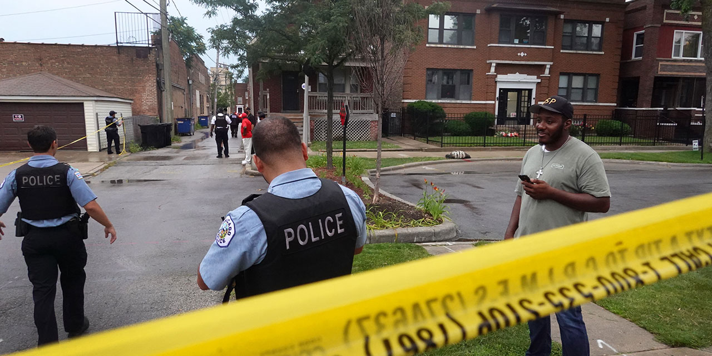

<h1 align="center"> Chicago SQL Code Summary</h1>

  

  

  
  
  
  
  

 

  <h2>Table of Contents</h2>
  <ul>
    <li><a href="#initial-problem" target="_parent">Identify Issues</a></li>
    <li><a href="#about-the-data">Inspect Data Structure</a></li>
    <li><a href="#data-set-used">Data Selection</a></li>
    <li><a href="#methods">Define Methodology</a></li>
    <li><a href="#tech-stack">Technology Utilization</a></li>
    <li><a href="#quick-glance">Preliminary Findings</a></li>
    <li><a href="#lesson-learned">Insights and Learnings</a></li>
    <li><a href="#limitation">Review Limitations</a></li>
    <li><a href="#notebook">Detailed Analysis</a></li>
    <li><a href="#report">Final Documentation</a></li>
  </ul>

  <section id="initial-problem">
    <h2>Identify Issues</h2>
    

 
- Missing Values: Identify columns with missing data. Determine if the missing data is random or systematic.
 
 
- Outliers: Look for unusual or extreme values that could indicate data entry errors or genuine anomalies.
 
 
- Consistency: Check for consistent formatting in dates, times, and categorical data like crime types and locations.
 

  <section id="about-the-data">
    <h2>Inspect Data Structure</h2>
    

<table border="1">
    <tr>
        <th>Column Name</th>
        <th>Description</th>
    </tr>
    <tr>
        <td>ID</td>
        <td>Unique identifier for the record. (Number)</td>
    </tr>
    <tr>
        <td>Case Number</td>
        <td>The Chicago Police Department RD Number (Records Division Number), unique to the incident. (Plain Text)</td>
    </tr>
    <tr>
        <td>Date</td>
        <td>Date when the incident occurred. This is sometimes a best estimate. (Date & Time)</td>
    </tr>
    <tr>
        <td>Block</td>
        <td>The partially redacted address where the incident occurred, placing it on the same block as the actual address. (Plain Text)</td>
    </tr>
    <tr>
        <td>IUCR</td>
        <td>The Illinois Uniform Crime Reporting code. Directly linked to the Primary Type and Description. (Plain Text)</td>
    </tr>
    <tr>
        <td>Primary Type</td>
        <td>The primary description of the IUCR code. (Plain Text)</td>
    </tr>
    <tr>
        <td>Description</td>
        <td>The secondary description of the IUCR code, a subcategory of the primary description. (Plain Text)</td>
    </tr>
    <tr>
        <td>Location Description</td>
        <td>Description of the location where the incident occurred. (Plain Text)</td>
    </tr>
    <tr>
        <td>Arrest</td>
        <td>Indicates whether an arrest was made. (Checkbox)</td>
    </tr>
    <tr>
        <td>Domestic</td>
        <td>Indicates whether the incident was domestic-related as defined by the Illinois Domestic Violence Act. (Checkbox)</td>
    </tr>
    <tr>
        <td>Beat</td>
        <td>Indicates the beat where the incident occurred. (Plain Text)</td>
    </tr>
    <tr>
        <td>District</td>
        <td>Indicates the police district where the incident occurred. (Plain Text)</td>
    </tr>
    <tr>
        <td>Ward</td>
        <td>The ward (City Council district) where the incident occurred. (Number)</td>
    </tr>
    <tr>
        <td>Community Area</td>
        <td>Indicates the community area where the incident occurred. (Plain Text)</td>
    </tr>
    <tr>
        <td>FBI Code</td>
        <td>Indicates the crime classification as outlined in the FBI's National Incident-Based Reporting System (NIBRS). (Plain Text)</td>
    </tr>
    <tr>
        <td>X Coordinate</td>
        <td>The x coordinate of the location where the incident occurred in State Plane Illinois East NAD 1983 projection. (Number)</td>
    </tr>
    <tr>
        <td>Y Coordinate</td>
        <td>The y coordinate of the location where the incident occurred in State Plane Illinois East NAD 1983 projection. (Number)</td>
    </tr>
    <tr>
        <td>Year</td>
        <td>Year the incident occurred. (Number)</td>
    </tr>
    <tr>
        <td>Updated On</td>
        <td>Date and time the record was last updated. (Date & Time)</td>
    </tr>
    <tr>
        <td>Latitude</td>
        <td>The latitude of the location where the incident occurred. (Number)</td>
    </tr>
    <tr>
        <td>Longitude</td>
        <td>The longitude of the location where the incident occurred. (Number)</td>
    </tr>
    <tr>
        <td>Location</td>
        <td>The location where the incident occurred in a format allowing for map creation and other geographic operations. (Location)</td>
    </tr>
</table>

  <section id="data-set-used">
    <h2>Define Methodology</h2>
    

We are only intrested in the data for the last 5 years starting from the initial date and we will go ahead and descending the following code in order to create a geographical hotspot zone to utilize via tableau or powerBI. Overall, the data seems clean and has been updated. For more information on updates: https://data.cityofchicago.org/browse?q=CRIME&sortBy=relevance

  <section id="methods">
    <h2>Technology Utilization</h2>
    

Exploring the Impact of Socio-Economic and Racial Factors on Maternal and Infant Health Outcomes in Different Counties

  <section id="tech-stack">
    <h2>Technology Utilization</h2>
    

Exploring the Impact of Socio-Economic and Racial Factors on Maternal and Infant Health Outcomes in Different Counties

 

